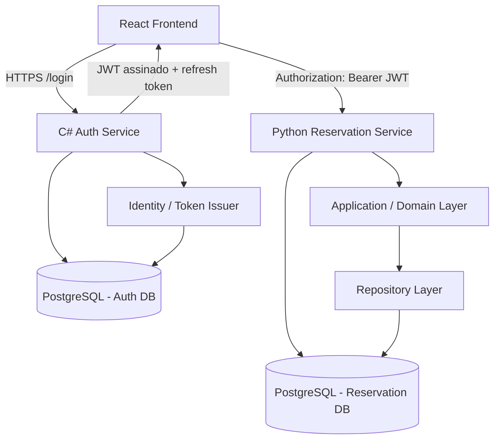
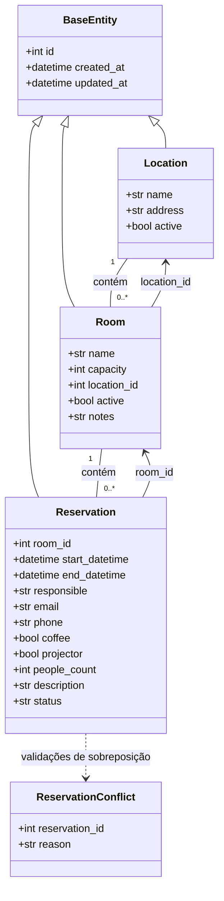

## Arquitetura de alto nível


## Diagrama de Domínio e Persistência


## Fluxo de Autenticação e Reserva
```
[1] Usuário autentica no Frontend
    |
    | POST /login (credentials)
    v
[2] Auth Service valida identidade e emite JWT
    |
    | access token + refresh token
    v
[3] Frontend armazena sessão e anexa Bearer Token
    |
    | Authorization: Bearer <jwt>
    v
[4] Reservation Service valida assinatura, expiração e claims
    |
    | policy / authorization checks
    v
[5] Application Service executa o caso de uso
    |
    | overlap, capacity, status, auditoria
    v
[6] Repository persiste em Reservation DB
    |
    v
[7] Resposta retorna com dados consolidados e status
```