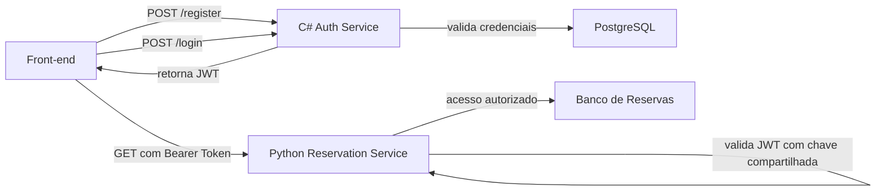

# BackendCsharp.API

Serviço de autenticação do desafio FullStack da Banana Ltda. Este backend em C# fica responsável por cadastro de usuários, login, hash de senha e emissão de JWT que será validado pelo backend Python de reservas.

## Responsabilidade na arquitetura

Este microsserviço não cuida de reservas. A responsabilidade dele é exclusivamente autenticação:

- cadastro de usuário por e-mail
- login com validação de credenciais
- emissão de token JWT
- persistência dos dados de autenticação em banco relacional

O token emitido aqui é consumido pelo backend Python via header `Authorization: Bearer <token>`.

## Stack adotada

- .NET 10 / ASP.NET Core Web API
- Entity Framework Core
- PostgreSQL
- BCrypt.Net-Next para hash de senha
- JWT com assinatura simétrica
- FluentValidation para validação de entrada

## Arquitetura e fluxo de integração



Para uma visão visual da arquitetura, fluxo de autenticação e modelo de domínio, consulte [**DIAGRAMAS.MD**](../DIAGRAMAS.MD).

### Fluxo de autenticação

1. O front-end envia `POST /api/user/register` ou `POST /api/user/login` para este serviço.
2. O backend C# autentica o usuário e retorna um JWT assinado com expiração configurável.
3. O front-end encaminha esse JWT em todas as requisições para serviços protegidos via header `Authorization: Bearer <token>`.
4. O backend Python valida o token localmente com a mesma chave configurada por variável de ambiente, sem chamadas de retorno.

## Endpoints

### `POST /api/user/register`

Cria um novo usuário.

Exemplo de payload:

```json
{
	"email": "user@email.com",
	"password": "Senha@123"
}
```

Retorno: usuário criado com `id`, `email` e `createdAt`.

### `POST /api/user/login`

Autentica o usuário e retorna o JWT.

Exemplo de payload:

```json
{
	"email": "user@email.com",
	"password": "Senha@123"
}
```

Retorno:

```json
{
	"token": "eyJhbGciOiJIUzI1NiIs..."
}
```

### `GET /api/user`

Endpoint protegido para validar o JWT e inspecionar as claims básicas do usuário autenticado.

## JWT gerado

O token inclui ao menos os seguintes claims:

- `sub`: identificador do usuário
- `email`: valor informado no cadastro/login
- `name`: nome de exibição do usuário
- `jti`: identificador único do token

## Variáveis de ambiente

O projeto usa a seção `Jwt` no `appsettings.json`, mas para o teste o ideal é sobrescrever esses valores por ambiente.

### Conexão com banco

- `ConnectionStrings__Default`

Exemplo:

```bash
ConnectionStrings__Default=Host=localhost;Port=5432;Database=csharp;Username=postgres;Password=admin
```

### JWT compartilhado com o backend Python

- `Jwt__Key`
- `Jwt__Issuer`
- `Jwt__Audience`
- `Jwt__ExpiresInMinutes`

Exemplo:

```bash
Jwt__Key=super-secret-key-change-this-1234567890
Jwt__Issuer=auth-service
Jwt__Audience=reservation-service
Jwt__ExpiresInMinutes=60
```

Observação importante: a mesma `Jwt__Key` deve existir no backend Python para validação local do token.

## Como rodar localmente

### Pré-requisitos

- .NET SDK compatível com o projeto
- PostgreSQL em execução

### Instalação

```bash
dotnet restore
```

### Banco de dados

Se necessário, aplique as migrations do Entity Framework Core:

```bash
dotnet ef database update --project BackendCsharp.API/BackendCsharp.API.csproj
```

### Execução

```bash
dotnet run --project BackendCsharp.API/BackendCsharp.API.csproj
```

## Decisões técnicas

- **BCrypt** para hash seguro de senhas, sem armazenamento em texto puro.
- **JWT com assinatura simétrica** para autenticação stateless e integração simplificada com backend Python.
- **Entity Framework Core** como ORM para persistência relacional com migrations versionadas.
- **FluentValidation** para separação de regras de validação da lógica de persistência.
- **.NET 10** para aproveitar as últimas melhorias de performance e recursos da plataforma.